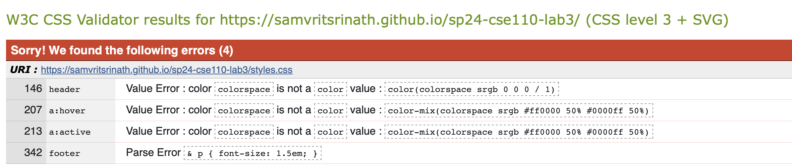

# Lab 3

Here is my Github Link: [https://samvritsrinath.github.io/sp24-cse110-lab3/](https://samvritsrinath.github.io/sp24-cse110-lab3/)

Here is the W3 Validation: 

The errors presented are either for the `color` or `color-mix` attributes, which are not supported by W3 CSS or the nested selectors recognized by _SCSS_.
